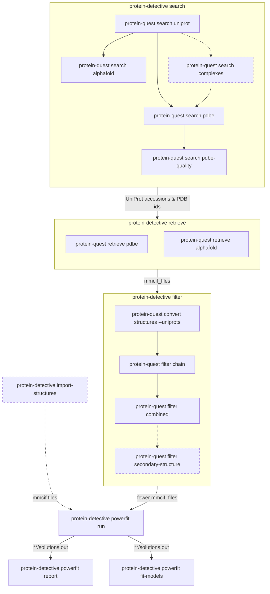

# protein-detective

[](https://www.bonvinlab.org/protein-detective/)
[](https://github.com/haddocking/protein-detective/actions/workflows/ci.yml)
[](https://www.research-software.nl/software/protein-detective)
[](https://pypi.org/project/protein-detective/)
[](https://doi.org/10.5281/zenodo.15632658)

Python package to detect proteins in EM density maps.

Have you ever had an coarse Electron Microscopy (EM) density map and was unable
to identify part of it? This package can help you to identify the protein in the
density map by searching for protein structures in Uniprot, PDBe and AlphaFold
DB and fitting them into the density map.

It uses

- [protein-quest](https://github.com/haddocking/protein-quest) to search,
  retrieve and filter protein structures from Uniprot, PDBe and AlphaFold DB.
- [powerfit](https://pypi.org/project/powerfit-em/) to fit protein structure in
  a Electron Microscopy (EM) density map.
- [cyclopts](https://cyclopts.readthedocs.io/en/latest/) for command line
  interface
- [molviewspec](https://molstar.org/mol-view-spec/) to visualize the fitted
  structures and density map in a web browser.
- [dask](https://dask.org/) to run powerfit in parallel on multiple CPU cores or
  GPUs.
- [Research Object Crate](https://www.researchobject.org/ro-crate/) and
  [rocrate-action-recorder](https://rocrate-action-recorder.readthedocs.io/) to
  keep track of commands and their input/output files/directories.
- [duckdb](https://duckdb.org/) to query CSV files like
  powerfit/_/_/solutions.out files.

Diagram how protein-detective calls protein-quest and powerfit:



(Dashed nodes are optional)

## Install

```shell
pip install protein-detective
```

Or to use the latest development version:

```shel
pip install git+https://github.com/haddocking/protein-detective.git
```

By default OpenCL support is included, but if you want to use CUDA, you can
install with:

```shell
# For CUDA version 13
pip install "protein-detective[cuda13]"
# or for CUDA version 12
pip install "protein-detective[cuda12]"
```

## Usage

The main entry point is the `protein-detective` command line tool which has
multiple subcommands to perform actions.

### Search Uniprot for structures

```shell
protein-detective search \
    --taxon-id 9606 \
    --reviewed \
    --subcellular-location-uniprot nucleus \
    --subcellular-location-go GO:0005634 \
    --molecular-function-go GO:0003677 \
    --limit-uniprot 100 \
    --pdbe.limit 100 \
    ./mysession
```

([GO:0005634](https://www.ebi.ac.uk/QuickGO/term/GO:0005634) is "Nucleus" and
[GO:0003677](https://www.ebi.ac.uk/QuickGO/term/GO:0003677) is "DNA binding")

In `./mysession` directory, you will find the search results.

<details>
<summary>You can also include interaction partners in the search</summary>

```shell
protein-detective search --verbose \
    --taxon-id 9606 \
    --reviewed \
    --subcellular-location-uniprot nucleus \
    --subcellular-location-go GO:0005634 \
    --molecular-function-go GO:0003677 \
    --interaction.seed A8MT69 \
    --interaction.exclude B1APH4 \
    --limit-uniprot 100 \
    --pdbe.limit 100 \
    ./mysession2
```

Which will add `Q96H22` which is an interaction partner of `A8MT69` in a
macromolecular complex.

</details>

### To retrieve a bunch of structures

```shell
protein-detective retrieve ./mysession
```

In `./mysession` directory, you will find mmCIF files from PDBe and PDB files
and AlphaFold DB.

### To filter structure

Filter structures based on

- For PDBe structures the chain of Uniprot protein is written as chain A.
- For AlphaFold structures filter by confidence (pLDDT) threshold
- Number of residues in chain A
  - For AlphaFold structures writes new files with low confidence residues
    (below threshold) removed
- Number of residues in secondary structure (helices and sheets)

Also uncompresses _.cif.gz files to_.cif files for compatibility with powerfit.

```shell
protein-detective filter \
    --min-confidence 50 \
    --min-residues 100 \
    --max-residues 1000 \
    ./mysession

# or to filter on secondary structure having some helices
protein-detective filter mysession --secondary.abs-min-helix-residues 40
```

### Import filtered structures

If you have a directory of structures ((optionally gzipped) PDB/mmCIF files),
each with a single chain called `A` and a single UniProt accession. You can
import them into a new protein detective session with:

```shell
protein-detective import-structures ./mysession/filtered ./mysession3
```

Imported structures can be used to run powerfit.

### Powerfit

Rotate and translate the prepared structures to fit and score them into the EM
density map using powerfit.

```shell
protein-detective powerfit run ../powerfit-tutorial/ribosome-KsgA.map 13 ./mysession
# or for with some flags
protein-detective powerfit run --workers-per-gpu 2 --angle 40 --powerfit-run-id myrun1 ../powerfit-tutorial/ribosome-KsgA.map 13 ./mysession4
```

This will use [dask-distributed](https://distributed.dask.org/en/latest/) to run
powerfit for each structure in parallel on multiple CPU cores or GPUs.

<details>

<summary>Run powerfits on Slurm</summary>

You can use [dask-jobqueue](https://jobqueue.dask.org/en/latest/) to run the
powerfits on a Slurm deployment on multiple machines on a shared filesystem.

In one terminal start the Dask cluster with

```shell
pip install dask-jobqueue
python3
```

```python
from dask_jobqueue import SLURMCluster

cluster = SLURMCluster(cores=8, processes=4, memory="16GB", queue="normal")
print(cluster.scheduler_address)
# Prints something like: 'tcp://192.168.1.1:34059'
# Keep this Python process running until powerfits are done
```

In second terminal, run the powerfits on Dask cluster with

```shell
protein-detective powerfit run ../powerfit-tutorial/ribosome-KsgA.map 13 docs/session1 --scheduler-address tcp://192.168.1.1:34059
```

</details>

<details>
<summary>How to run efficiently</summary>

Powerfit is quickest on GPU, but can also run on CPU.

To run powerfits on a CPU you can use the `--cpu`. If you do not use `--cpu`
flag, then powerfit will run on GPU (the default). If your GPU is underutilized,
you can increase the number of workers per GPU with `--workers-per-gpu <int>`.
You can start with 1 (the default) and monitor the GPU usage with `nvtop` if you
see that the GPU is not 100% loaded, you can increase the number until there are
no more valleys in the GPU usage graph.

If you have multiple GPUs, then `--workers-per-gpu 2` will run powerfits on all
GPUs and run 2 powerfits concurrently on each GPU.

With `--cpu` each powerfit will use 1 CPU core and run multiple powerfits in
parallel according to the number of physical CPU cores available on the machine
(so excluding hyperthreaded cores).

You can set the `--nproc <int>` so each powerfit will use that many CPU cores.
This is useful if you have more CPU cores available then there are structures to
fit. If the number of structure to fit is greater than available CPU cores then
using the default (1 core per powerfit) is recommended.

In testing on highend NVIDIA GPUs the OpenCL backend is faster than CUDA
backend, so we default to using OpenCL. To use CUDA instead, you can set
`--gpu-backend cuda` and make sure you installed protein-detective with the
appropriate CUDA extra.

For example

```shell
protein-detective powerfit run --batch-size 50 --gpu-backend cuda ../powerfit-tutorial/ribosome-KsgA.map 13 ./mysession
```

</details>

<details>

<summary>Alternatively run powerfit yourself</summary>

You can use the `protein-detective powerfit commands` to print the commands.

The commands can then be run in whatever way you prefer, like sequentially, with
[GNU parallel](https://www.gnu.org/software/parallel/), or as a
[Slurm array job](https://slurm.schedmd.com/job_array.html).

For example to run with parallel and 4 slots:

```shell
protein-detective powerfit commands ../powerfit-tutorial/ribosome-KsgA.map 13 docs/session1 > commands.txt
parallel --jobs 4 < commands.txt
```

</details>

To list the completed powerfit runs, you can use:

```shell
protein-detective powerfit list-runs mysession
```

Which will output something like:

```csv
powerfit_run_id,density_map,run_dir,options
myrun1,mysession/powerfit/myrun1/ribosome-KsgA.map,mysession/powerfit/myrun1,--workers-per-gpu 2 --angle 40 --powerfit-run-id myrun1 ../powerfit-tutorial/ribosome-KsgA.map 13 ./mysession
```

To print top 1 solution per template structure to the terminal, you can use:

```shell
protein-detective powerfit report mysession
```

Outputs something like:

```csv
powerfit_run_id,structure,rank,cc,fishz,relz,translation,rotation,template_file,uniprot_accessions,pdb_id
myrun1,3i8z_updated_A2A.cif.gz,1,0.598,0.69,12.959,239.46:187.27:211.83,-0.238:0.322:0.916:0.916:-0.238:0.322:0.322:0.916:-0.238,mysession/combined_output/3i8z_updated_A2A.cif.gz,O00257,3I8Z
myrun1,6mzc_updated_E2A.cif.gz,1,0.547,0.614,14.671,199.55:214.9:165.78,1.0:0.0:0.0:0.0:-1.0:0.0:0.0:0.0:-1.0,mysession/combined_output/6mzc_updated_E2A.cif.gz,O00268,6MZC
...
```

To generate model PDB files rotated/translated to top 1 solution per template
structure, you can use:

```shell
protein-detective powerfit fit-models mysession
```

Outputs something like:

```csv
powerfit_run_id,structure,rank,fitted_model_file,unfitted_model_file
myrun1,3i8z_updated_A2A.cif.gz,1,mysession/powerfit/myrun1/3i8z_updated_A2A.cif.gz/fit_1.pdb,mysession/combined_output/3i8z_updated_A2A.cif.gz
myrun1,6mzc_updated_E2A.cif.gz,1,mysession/powerfit/myrun1/6mzc_updated_E2A.cif.gz/fit_1.pdb,mysession/combined_output/6mzc_updated_E2A.cif.gz
...
```

Where the `fitted_model_file` column is the structure file of the fitted model
and `unfitted_model_file` is the original structure file.

The results can also be visualized see
[visualization.ipynb](https://bonvinlab.org/protein-detective/docs/visualization.html)
for an example.

## Contributing

For development information and contribution guidelines, please see
[CONTRIBUTING.md](CONTRIBUTING.md).
